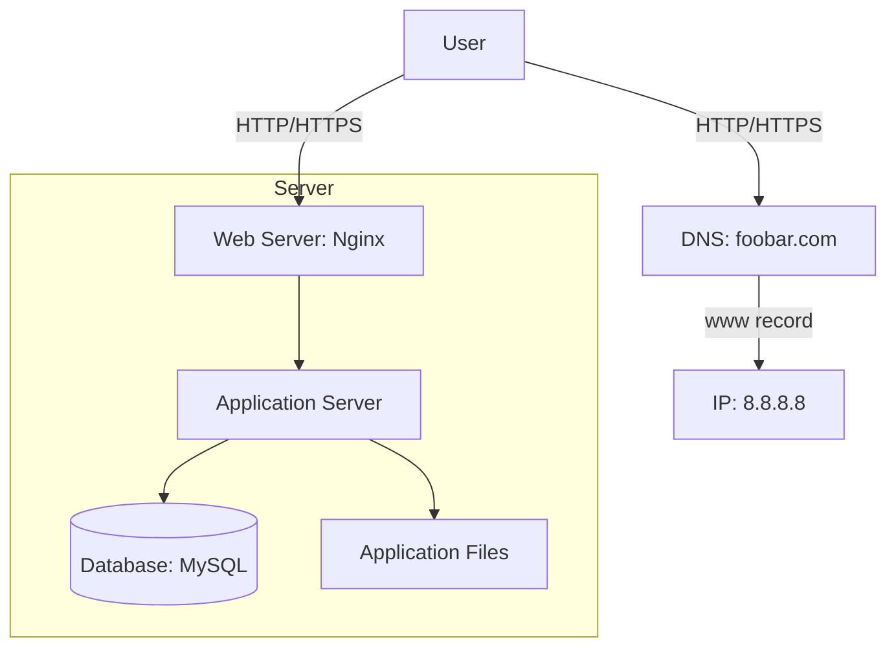

# Simple Web Infrastructure

## Infrastructure Diagram

## Infrastructure Explanation

### Components and their Roles

1. **Server**
   - A physical or virtual machine that hosts all the components needed to run the website
   - Provides computing resources (CPU, RAM, Disk) to run the applications

2. **Domain Name (foobar.com)**
   - Provides a human-readable address to access the website
   - Configured with a www record pointing to the server's IP (8.8.8.8)

3. **DNS Record (www)**
   - The www in www.foobar.com is a CNAME (Canonical Name) record
   - Points the www subdomain to the server's IP address

4. **Web Server (Nginx)**
   - Handles incoming HTTP requests
   - Serves static content
   - Forwards dynamic requests to the application server

5. **Application Server**
   - Executes the application's business logic
   - Processes dynamic content
   - Communicates with the database

6. **Database (MySQL)**
   - Stores and manages the website's data
   - Handles data queries from the application server

7. **Communication Flow**
   - Server uses HTTP/HTTPS protocols to communicate with users' computers
   - TCP/IP protocol suite handles the underlying network communication

## Infrastructure Issues

### Single Point of Failure (SPOF)
- The entire infrastructure is on a single server
- If the server fails, the website becomes completely inaccessible
- Hardware failures, network issues, or software crashes can cause downtime

### Maintenance Downtime
- Deploying new code requires restarting the web server
- Updates and maintenance cause service interruption
- No redundancy to handle traffic during maintenance

### Scalability Limitations
- Cannot handle high traffic loads efficiently
- No load balancing capability
- Resources (CPU, RAM) are limited to a single server
- No ability to scale horizontally