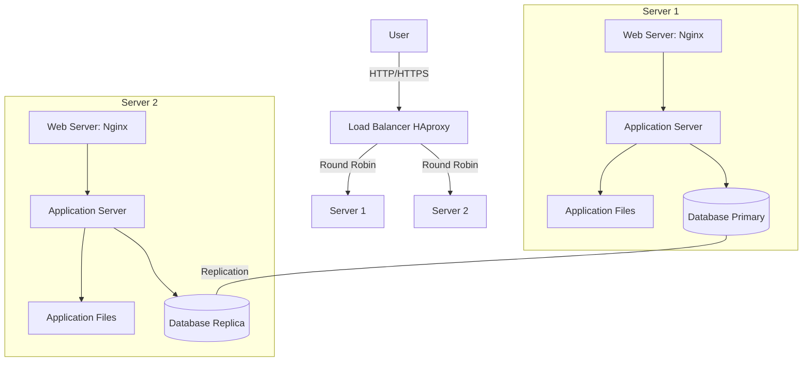

# Distributed Web Infrastructure

## Infrastructure Diagram

## Infrastructure Explanation

### Additional Elements and Their Purpose

1. **Load Balancer (HAproxy)**
   - Distributes incoming traffic between the two servers
   - Improves reliability and availability
   - Enables horizontal scaling

2. **Second Server**
   - Provides redundancy
   - Increases system reliability
   - Allows for higher traffic handling

### Load Balancer Configuration

1. **Distribution Algorithm**
   - Uses Round Robin algorithm
   - Requests are distributed sequentially between servers
   - Each server receives equal share of traffic

2. **Load Balancer Setup**
   - Active-Active setup
   - Both servers actively handle traffic simultaneously
   - Maximizes resource usage and throughput
   
   *VS Active-Passive:*
   - In Active-Passive, only one server handles traffic while the other is on standby
   - Less efficient resource utilization but simpler failover

### Database Primary-Replica Cluster

1. **How it Works**
   - Primary node handles write operations
   - Replica node synchronizes with primary
   - Replication is asynchronous

2. **Node Differences**
   - Primary Node:
     - Handles write operations
     - Source of truth for data
     - Updates are propagated to replica
   - Replica Node:
     - Handles read operations
     - Provides redundancy
     - Can be promoted to primary if needed

## Infrastructure Issues

### Single Points of Failure (SPOF)
- Load balancer is a SPOF
- Primary MySQL database is a SPOF
- Each server has single points of failure in its components

### Security Issues
- No firewall protection
- No HTTPS encryption
- Lack of security measures against attacks

### Monitoring Gaps
- No monitoring system in place
- Cannot track system health
- No way to detect and respond to issues proactively
- No performance metrics collection