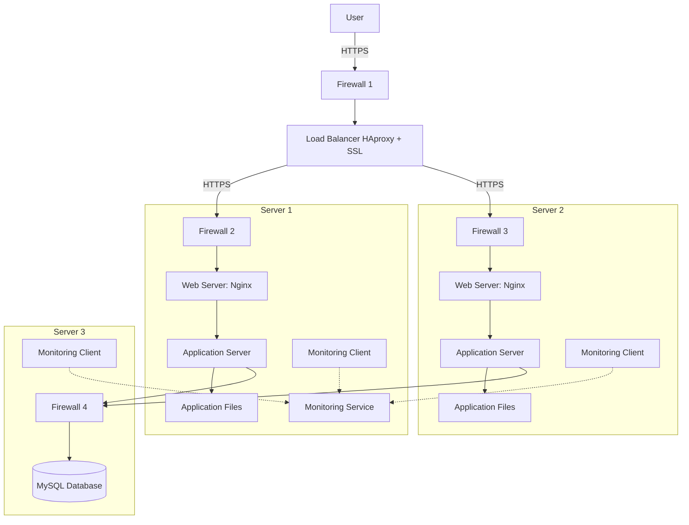

# Secured and Monitored Web Infrastructure

## Infrastructure Diagram

## Infrastructure Explanation

### Additional Security Elements

1. **Firewalls**
   - Control incoming and outgoing traffic
   - Protect servers from unauthorized access
   - Filter malicious traffic
   - Implement security policies

2. **SSL Certificate**
   - Enables HTTPS for encrypted traffic
   - Protects sensitive data in transit
   - Provides authentication and trust
   - Required for secure online transactions

3. **Monitoring Clients**
   - Collect system and application metrics
   - Monitor server health and performance
   - Track resource usage
   - Enable proactive issue detection

### Monitoring Details

1. **Purpose**
   - Track system health and performance
   - Detect and alert on issues
   - Analyze trends and patterns
   - Support capacity planning

2. **Data Collection**
   - Monitoring clients collect metrics
   - System metrics (CPU, memory, disk)
   - Application metrics (response times, errors)
   - Network metrics (bandwidth, latency)
   - Log files and events

3. **QPS Monitoring**
   - Monitor Queries Per Second at web server
   - Set up specific metrics in monitoring tool
   - Create dashboards for visualization
   - Configure alerts for threshold violations

## Infrastructure Issues

1. **SSL Termination at Load Balancer**
   - Traffic between load balancer and servers is unencrypted
   - Internal network vulnerable to attacks
   - Increased security risk within infrastructure

2. **Single Write Database**
   - No database redundancy for writes
   - Single point of failure for write operations
   - Potential data loss or service interruption
   - Limited write scalability

3. **Uniform Server Components**
   - All servers have same components
   - No specialization for specific tasks
   - Resource allocation may be inefficient
   - Harder to optimize for specific workloads
   - Increased maintenance complexity