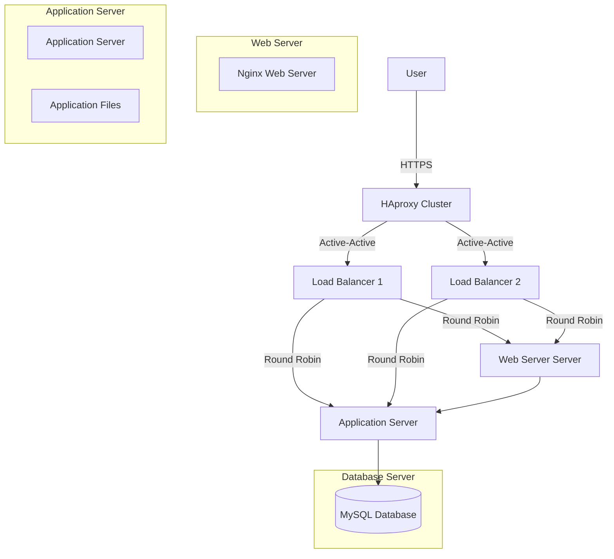

# Scale Up Infrastructure

## Infrastructure Diagram

## Infrastructure Explanation

### Additional Elements and Their Purpose

1. **Split Components**
   - Each major component (web server, application server, database) runs on its own server
   - Allows for specialized resource allocation
   - Enables independent scaling of components
   - Improves security through isolation

2. **Load Balancer Cluster**
   - Two HAproxy instances in active-active configuration
   - Provides high availability for load balancing
   - Eliminates load balancer as single point of failure
   - Enables maintenance without downtime

3. **Dedicated Servers**
   - **Web Server Server:**
     - Focused on serving static content
     - Optimized for HTTP/HTTPS traffic handling
     - Can be scaled independently based on traffic
   
   - **Application Server:**
     - Dedicated to running application logic
     - Resources optimized for application needs
     - Can be scaled based on processing demands
   
   - **Database Server:**
     - Dedicated to database operations
     - Optimized for data storage and retrieval
     - Can be scaled based on data requirements

### Benefits of This Architecture

1. **Improved Performance**
   - Each component can be optimized independently
   - Resource allocation based on specific needs
   - Reduced resource competition

2. **Better Scalability**
   - Components can be scaled horizontally or vertically
   - Easier to identify and address bottlenecks
   - More flexible capacity planning

3. **Enhanced Reliability**
   - Failure in one component doesn't affect others
   - Easier maintenance and updates
   - Better isolation for security